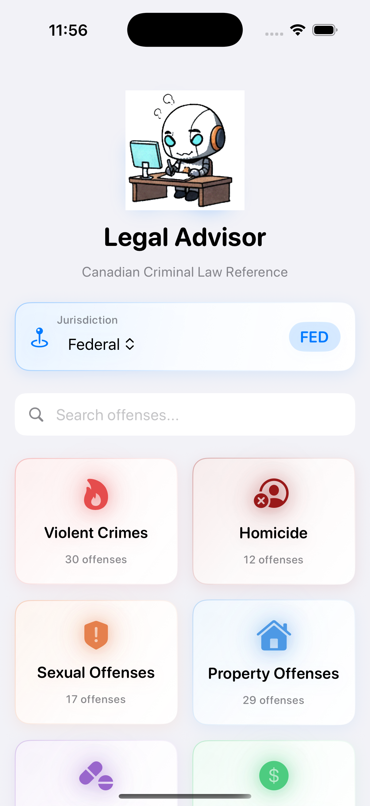

# Legal Advisor

A comprehensive iOS app for Canadian criminal law reference. Browse offenses by category, view sentencing guidelines based on age and jurisdiction, and access official legislation sources.

## Features

- **200+ Criminal Offenses** - Comprehensive database covering the Criminal Code, CDSA, Cannabis Act, Firearms Act, and more
- **16 Crime Categories** - Organized into Violent Crimes, Homicide, Sexual Offenses, Property Offenses, Drug Offenses, Weapons, Fraud, Public Order, Administration of Justice, Motor Vehicle, Terrorism, Organized Crime, Cybercrime, Environmental, Youth-Specific, and Other Offenses
- **Age-Based Sentencing** - Slider to see how Youth Criminal Justice Act affects sentencing (ages 12-17)
- **Jurisdiction Selection** - Federal and provincial jurisdiction support
- **Direct Source Links** - Tap to view the exact section on laws-lois.justice.gc.ca
- **Search** - Quick search across all offenses

## Screenshots

| Home | Category List | Crime Detail |
|------|---------------|--------------|
|  | Coming soon | Coming soon |

## Tech Stack

- Swift
- SwiftUI
- iOS 17+

## Data Sources

All offense data is sourced from official Canadian legislation:
- [Criminal Code (R.S.C., 1985, c. C-46)](https://laws-lois.justice.gc.ca/eng/acts/c-46/)
- [Controlled Drugs and Substances Act](https://laws-lois.justice.gc.ca/eng/acts/c-38.8/)
- [Cannabis Act](https://laws-lois.justice.gc.ca/eng/acts/c-24.5/)
- [Firearms Act](https://laws-lois.justice.gc.ca/eng/acts/f-11.6/)

## Disclaimer

This app is for educational purposes only and does not constitute legal advice. Always consult a qualified lawyer for legal matters.

## License

MIT
